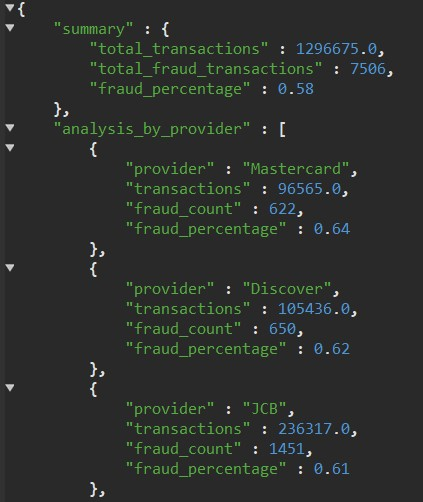
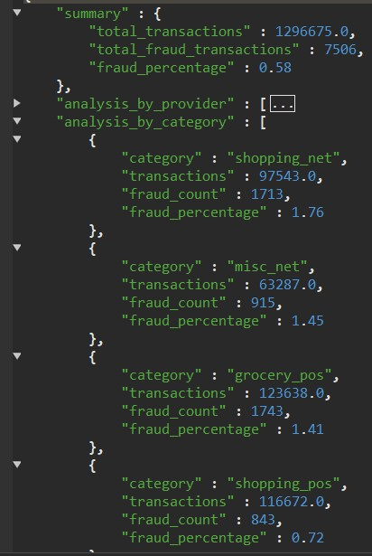

# Analiza Prevara - Card Provideri i Kategorije

Za svaku vrstu kartice (Visa, MasterCard, AmEx), izračunaj procenat prevarantskih transakcija, ukupan iznos prevara i distribuciju po kategorijama trgovaca kako bi se identifikovale specifične ranjivosti po brendu?

## MongoDB Upit

```javascript
// Detaljana analiza prevara po brendovima kreditnih kartica
db.transactions.aggregate([
  // Spoji transakcije sa kreditnim karticama
  {
    $lookup: {
      from: "credit_cards",
      localField: "credit_card_id", 
      foreignField: "_id",
      as: "card"
    }
  },
  {$unwind: "$card"},
  
  // Konvertuj polja za kalkulacije
  {
    $addFields: {
      is_fraud_num: {$toInt: "$is_fraud"},
      amount_num: {$toDouble: "$amt"}
    }
  },
  
  // Grupiši po brendu kartice i kategoriji trgovca
  {
    $group: {
      _id: {
        card_provider: "$card.card_provider",
        category: "$category"
      },
      total_transactions: {$sum: 1},
      fraud_transactions: {$sum: "$is_fraud_num"},
      total_amount: {$sum: "$amount_num"},
      fraud_amount: {
        $sum: {
          $cond: [
            {$eq: ["$is_fraud_num", 1]}, 
            "$amount_num", 
            0
          ]
        }
      }
    }
  },
  
  // Kalkuliši procente za svaku kategoriju po brendu
  {
    $addFields: {
      category_fraud_percentage: {
        $round: [
          {$multiply: [
            {$divide: ["$fraud_transactions", "$total_transactions"]}, 
            100
          ]},
          2
        ]
      },
      category_fraud_amount_percentage: {
        $round: [
          {$multiply: [
            {$cond: [
              {$gt: ["$total_amount", 0]},
              {$divide: ["$fraud_amount", "$total_amount"]},
              0
            ]}, 
            100
          ]},
          2
        ]
      }
    }
  },
  
  // Grupiši po brendu kartice
  {
    $group: {
      _id: "$_id.card_provider",
      total_transactions: {$sum: "$total_transactions"},
      total_fraud_transactions: {$sum: "$fraud_transactions"},
      total_amount: {$sum: "$total_amount"},
      total_fraud_amount: {$sum: "$fraud_amount"},
      category_breakdown: {
        $push: {
          category: "$_id.category",
          transactions: "$total_transactions",
          fraud_count: "$fraud_transactions",
          fraud_percentage: "$category_fraud_percentage",
          total_amount: {$round: ["$total_amount", 2]},
          fraud_amount: {$round: ["$fraud_amount", 2]},
          fraud_amount_percentage: "$category_fraud_amount_percentage"
        }
      }
    }
  },
  
  // Kalkuliši ukupne procente po brendu
  {
    $addFields: {
      overall_fraud_percentage: {
        $round: [
          {$multiply: [
            {$divide: ["$total_fraud_transactions", "$total_transactions"]}, 
            100
          ]}, 
          2
        ]
      },
      overall_fraud_amount_percentage: {
        $round: [
          {$multiply: [
            {$cond: [
              {$gt: ["$total_amount", 0]},
              {$divide: ["$total_fraud_amount", "$total_amount"]},
              0
            ]}, 
            100
          ]}, 
          2
        ]
      }
    }
  },
  
  // Sortiraj kategorije po fraud procentu
  {
    $addFields: {
      category_breakdown: {
        $sortArray: {
          input: "$category_breakdown",
          sortBy: { fraud_percentage: -1 }
        }
      }
    }
  },
  
  // Identifikuj najrizičnije kategorije za svaki brend
  {
    $addFields: {
      highest_risk_category: {$arrayElemAt: ["$category_breakdown", 0]},
      lowest_risk_category: {
        $arrayElemAt: [
          {
            $sortArray: {
              input: "$category_breakdown",
              sortBy: { fraud_percentage: 1 }
            }
          }, 
          0
        ]
      }
    }
  },
  
  // Sortiraj brendove po ukupnom fraud procentu
  {$sort: {"overall_fraud_percentage": -1}},
  
  // Formatuj finalni rezultat
  {
    $project: {
      _id: 0,
      card_brand: "$_id",
      fraud_analysis: {
        total_transactions: "$total_transactions",
        fraud_transactions: "$total_fraud_transactions",
        fraud_percentage: "$overall_fraud_percentage",
        total_amount: {$round: ["$total_amount", 2]},
        fraud_amount: {$round: ["$total_fraud_amount", 2]},
        fraud_amount_percentage: "$overall_fraud_amount_percentage"
      },
      vulnerability_assessment: {
        highest_risk_category: "$highest_risk_category.category",
        highest_risk_percentage: "$highest_risk_category.fraud_percentage",
        lowest_risk_category: "$lowest_risk_category.category", 
        lowest_risk_percentage: "$lowest_risk_category.fraud_percentage",
        risk_spread: {
          $round: [
            {$subtract: [
              "$highest_risk_category.fraud_percentage",
              "$lowest_risk_category.fraud_percentage"
            ]},
            2
          ]
        }
      },
      category_details: "$category_breakdown"
    }
  }
])
```

## Rezultati

Upit će mi pokazati koji provideri kartica su najrizičniji kada je reč o prevarama. Takođe će mi dati uvid u to koje kategorije trgovaca (benzinske pumpe, restorani, online kupovina) privlače najviše prevaranata.

**Napomena:** Izvršavanje upita traje 1:06m

### Analiza po Card Providerima


### Distribucija po Kategorijama


---

*Miloš - Oktobar 2025*