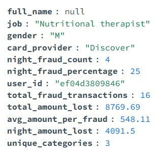
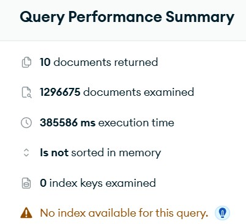

# Top 10 Žrtava Prevara 

Identifikuje top 10 korisnika sa najviše prevarantskih transakcija, analizira njihov profil, lokaciju, finansijske gubitke, i temporalne obrasce (fokus na noćne prevare 18-24h).

## Korišćene Tabele

1. **transactions** - Fraud transakcije
2. **credit_cards** - Podaci o karticama (provider)
3. **users** - Profil žrtve (ime, posao, pol)
4. **locations** - Geografski podaci (user lokacija + merchant lokacija)

## MongoDB Upit

```javascript
db.transactions.aggregate([
  {
    $match: {
      is_fraud: "1"
    }
  },
  
  // Join sa credit_cards
  {
    $lookup: {
      from: "credit_cards",
      localField: "credit_card_id",
      foreignField: "_id",
      as: "card"
    }
  },
  {$unwind: "$card"},
  
  // Join sa users
  {
    $lookup: {
      from: "users",
      localField: "card.user_id",
      foreignField: "_id",
      as: "user"
    }
  },
  {$unwind: "$user"},
  
  // Join sa locations (merchant location)
  {
    $lookup: {
      from: "locations",
      localField: "merchant_id",
      foreignField: "merchant_id",
      as: "merchant_location"
    }
  },
  {$unwind: {path: "$merchant_location", preserveNullAndEmptyArrays: true}},
  
  // Join sa locations (user location)
  {
    $lookup: {
      from: "users",
      localField: "user._id",
      foreignField: "user_id",
      as: "user_location"
    }
  },
  {$unwind: {path: "$user_location", preserveNullAndEmptyArrays: true}},
  
  // Ekstrakcija temporalnih podataka
  {
    $addFields: {
      amount_num: {$toDouble: "$amt"},
      hour: {$toInt: {$substr: ["$trans_date_trans_time", 11, 2]}},
      is_night: {
        $cond: [
          {$gte: [{$toInt: {$substr: ["$trans_date_trans_time", 11, 2]}}, 18]},
          1,
          0
        ]
      }
    }
  },
  
  // Grupiranje po korisniku
  {
    $group: {
      _id: "$user._id",
      full_name: {$first: {$concat: ["$user.first_name", " ", "$user.last_name"]}},
      job: {$first: "$user.job"},
      gender: {$first: "$user.gender"},
      user_city: {$first: "$user_location.city"},
      user_state: {$first: "$user_location.state"},
      card_provider: {$first: "$card.card_provider"},
      
      total_fraud_count: {$sum: 1},
      total_amount_lost: {$sum: "$amount_num"},
      
      // Noćne prevare (18-24h)
      night_fraud_count: {$sum: "$is_night"},
      night_amount_lost: {
        $sum: {
          $cond: [
            {$eq: ["$is_night", 1]},
            "$amount_num",
            0
          ]
        }
      },
      
      // Kategorije trgovaca
      merchant_categories: {$addToSet: "$category"},
      
      // Gradovi trgovaca
      merchant_cities: {$addToSet: "$merchant_location.city"}
    }
  },
  
  // Kalkulacije procenata
  {
    $addFields: {
      night_fraud_percentage: {
        $round: [
          {$multiply: [
            {$divide: ["$night_fraud_count", "$total_fraud_count"]},
            100
          ]},
          2
        ]
      },
      avg_fraud_amount: {
        $round: [
          {$divide: ["$total_amount_lost", "$total_fraud_count"]},
          2
        ]
      },
      category_count: {$size: "$merchant_categories"},
      merchant_city_count: {$size: "$merchant_cities"}
    }
  },
  
  // Sortiranje po broju prevara
  {$sort: {total_fraud_count: -1}},
  
  // Top 10
  {$limit: 10},
  
  // Finalni format
  {
    $project: {
      _id: 0,
      user_id: "$_id",
      victim_profile: {
        full_name: "$full_name",
        job: "$job",
        gender: "$gender",
        location: {
          $concat: ["$user_city", ", ", "$user_state"]
        },
        card_provider: "$card_provider"
      },
      fraud_statistics: {
        total_fraud_transactions: "$total_fraud_count",
        total_amount_lost: {$round: ["$total_amount_lost", 2]},
        avg_amount_per_fraud: "$avg_fraud_amount"
      },
      night_fraud_analysis: {
        night_fraud_count: "$night_fraud_count",
        night_amount_lost: {$round: ["$night_amount_lost", 2]},
        night_fraud_percentage: "$night_fraud_percentage"
      },
      merchant_diversity: {
        unique_categories: "$category_count",
        unique_cities: "$merchant_city_count",
        top_categories: {$slice: ["$merchant_categories", 5]},
        top_merchant_cities: {$slice: ["$merchant_cities", 5]}
      }
    }
  }
])
```

## Rezultati


### Kompleksnost Analize





---

*Miloš - Oktobar 2025*
