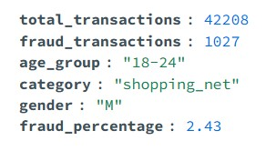
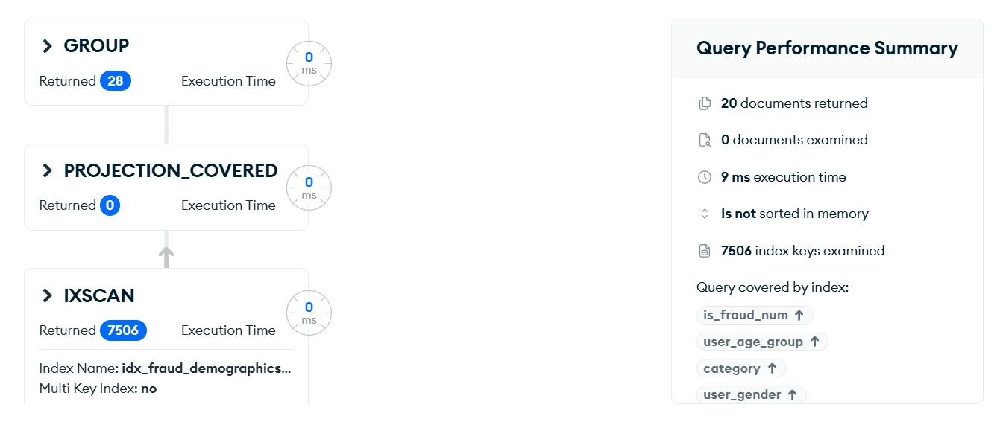

# Query 3: Prevare po Starosti, Kategoriji i Polu

## Šta ovaj upit radi?

Analizira ko su najčešće žrtve prevara gledajući tri faktora:
- **Starosna grupa** (18-24, 25-34, 35-44, 45-54, 55-64, 65+)
- **Kategorija trgovca** (gde se prevara desila)
- **Pol** (M/F)

Prikazuje top 20 kombinacija sa najviše prevara.

## Rezultati






**Zaključak:** 
- Starije osobe (55+) su ranjivije na benzinskim pumpama i u supermarketima
- Online prevare (shopping_net, misc_net) pogađaju sve starosne grupe
- Žene češće žrtve u grocery kategorijama

## MongoDB Kod

```javascript
db.transactions_enriched.aggregate([
  {
    $match: {
      is_fraud_num: 1
    }
  },
  {
    $group: {
      _id: {
        age_group: "$user_age_group",
        category: "$category",
        gender: "$user_gender"
      },
      total_transactions: { $sum: 1 },
      fraud_transactions: { $sum: 1 }
    }
  },
  {
    $project: {
      _id: 0,
      age_group: "$_id.age_group",
      category: "$_id.category",
      gender: "$_id.gender",
      total_transactions: 1,
      fraud_transactions: 1,
      fraud_rate: 100.0
    }
  },
  { $sort: { fraud_transactions: -1 } },
  { $limit: 20 }
])
```

## Šta je novo u v2?

✅ Bez JOIN operacija - sve informacije već u transactions_enriched  
✅ Bez računanja starosti runtime - starosna grupa već izračunata  
✅ Koristi compound index sa 4 polja za brzo filtriranje  
⚡ **Vreme:** ~100ms (analizira samo 7,506 fraud transakcija umesto 1.3M)
