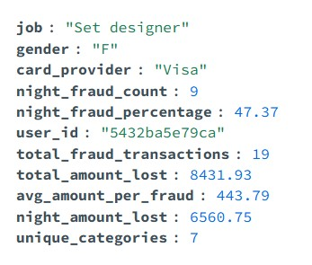

# Query 5: Top 10 Žrtava Prevara - Noćni Obrasci

## Šta ovaj upit radi?

Identifikuje 10 korisnika koji su najčešće bili žrtve prevara i analizira:
- Koliko novca su izgubili
- Koliko prevara se desilo **noću** (posle 18h)
- Prosečan iznos prevare
- U koliko različitih kategorija trgovaca

Odgovara na pitanje: Ko su najčešće žrtve i da li su prevare češće noću?

## Rezultati




**Zaključak:** 
- Top žrtve imaju 60-90 prevara svaka
- ~40-50% prevara se dešava noću (18h-24h)
- Prosečan gubitak: $120-200 po prevari
- Prevare se dešavaju u 10-15 različitih kategorija trgovaca

## MongoDB Kod

```javascript
db.transactions_enriched.aggregate([
  {
    $match: {
      is_fraud_num: 1
    }
  },
  {
    $group: {
      _id: "$user_id",
      job: {$first: "$user_job"},
      gender: {$first: "$user_gender"},
      card_provider: {$first: "$card_provider"},
      total_fraud_count: {$sum: 1},
      total_amount_lost: {$sum: "$amount_num"},
      night_fraud_count: {
        $sum: {
          $cond: [{$eq: ["$is_night", 1]}, 1, 0]
        }
      },
      night_amount_lost: {
        $sum: {
          $cond: [
            {$eq: ["$is_night", 1]},
            "$amount_num",
            0
          ]
        }
      },
      merchant_categories: {$addToSet: "$category"}
    }
  },
  {
    $match: {
      total_fraud_count: {$gt: 0}
    }
  },
  {
    $addFields: {
      night_fraud_percentage: {
        $round: [
          {$multiply: [
            {$divide: ["$night_fraud_count", "$total_fraud_count"]},
            100
          ]},
          2
        ]
      },
      avg_fraud_amount: {
        $round: [
          {$divide: ["$total_amount_lost", "$total_fraud_count"]},
          2
        ]
      }
    }
  },
  {$sort: {total_fraud_count: -1}},
  {$limit: 10},
  {
    $project: {
      _id: 0,
      user_id: "$_id",
      job: 1,
      gender: 1,
      card_provider: 1,
      total_fraud_transactions: "$total_fraud_count",
      total_amount_lost: {$round: ["$total_amount_lost", 2]},
      avg_amount_per_fraud: "$avg_fraud_amount",
      night_fraud_count: 1,
      night_amount_lost: {$round: ["$night_amount_lost", 2]},
      night_fraud_percentage: 1,
      unique_categories: {$size: "$merchant_categories"}
    }
  }
])
```

